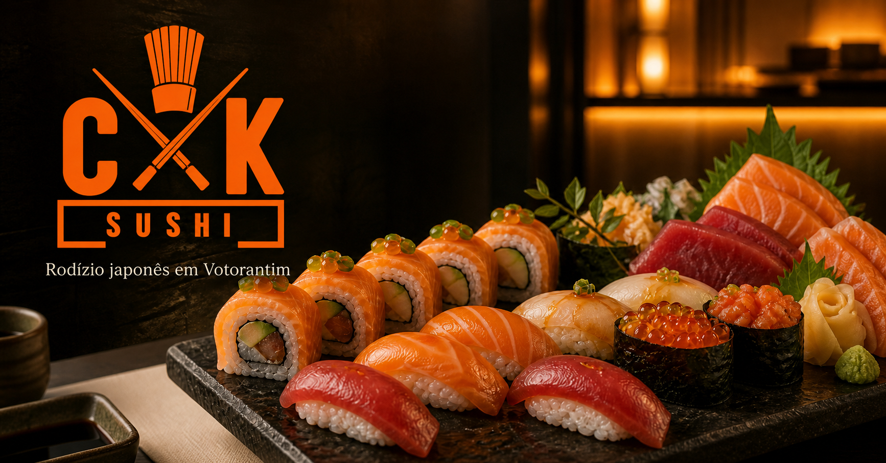

# CK Sushi — experiência digital para restaurante japonês




Site premium e responsivo criado para o **CK Sushi**, com foco em apresentar a experiência gastronômica, facilitar reservas e transmitir a qualidade do restaurante antes mesmo da visita.

## O desafio

Restaurantes dependem muito da primeira impressão visual. O projeto precisava combinar fotografia editorial, navegação rápida e chamadas para reserva sem transformar o site em um cardápio genérico ou pesado.

## A solução

- direção visual inspirada em experiências gastronômicas premium;
- galeria editorial com imagens otimizadas em múltiplos tamanhos;
- navegação responsiva, incluindo experiência específica para celulares;
- chamadas de reserva sempre acessíveis;
- área administrativa local para manutenção de conteúdo;
- página 404 personalizada;
- SEO técnico com metadados, sitemap e robots;
- cabeçalhos de segurança e política de conteúdo configurados.

## Tecnologias

`Next.js 16` · `React 19` · `TypeScript` · `Tailwind CSS` · `Vinext` · `Vercel`

## Destaques técnicos

As imagens possuem versões responsivas para reduzir o carregamento em dispositivos móveis. O layout foi revisado em larguras pequenas para eliminar estouros horizontais, preservar a hierarquia do conteúdo e manter os controles de reserva utilizáveis.

## Executando localmente

Requer Node.js 22.13 ou superior.

```bash
npm install
npm run dev
```

Verificações do projeto:

```bash
npm run lint
npm run build:vercel
```

---

Projeto de UI/UX e desenvolvimento frontend para o CK Sushi.
